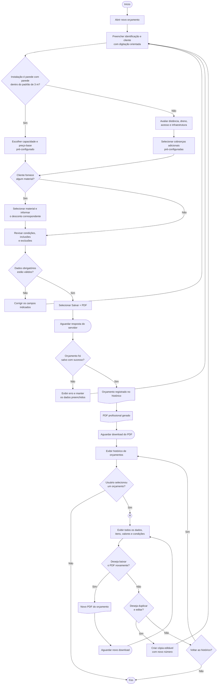
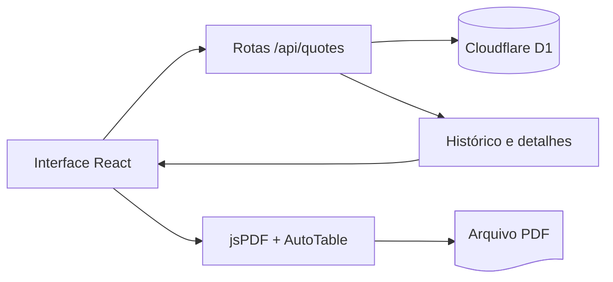

# Clima Orçamentos

Aplicativo web responsivo para criar, salvar, consultar e exportar orçamentos profissionais de instalação e manutenção de ar-condicionado diretamente no local do atendimento.

- **Aplicação publicada:** [clima-orcamentos-isaac.voidisaac88.chatgpt.site](https://clima-orcamentos-isaac.voidisaac88.chatgpt.site)
- **Repositório:** [github.com/Gorgommel/clima-orcamentos](https://github.com/Gorgommel/clima-orcamentos)
- **Interface:** otimizada para celulares, tablets e computadores
- **Persistência:** Cloudflare D1, com binding R2 disponível para arquivos
- **Documentos:** PDF profissional gerado no navegador

## Visão geral

O Clima Orçamentos reúne em um único fluxo os dados do prestador, cliente, equipamento, serviços, materiais, condições comerciais e escopo técnico. Ao confirmar um orçamento, o sistema primeiro registra os dados no histórico persistente e, após a confirmação do servidor, gera o PDF automaticamente.

O histórico permite abrir cada registro, consultar todas as informações, baixar novamente o PDF e duplicar uma proposta para criar uma nova versão. Registros criados em versões anteriores continuam disponíveis e são adaptados para o formato atual durante a consulta, sem alteração ou exclusão dos dados originais.

## Funcionalidades

### Criação do orçamento

- Número de proposta gerado automaticamente e editável.
- Datas de emissão e validade.
- Dados do prestador: nome, CPF/CNPJ, telefone e e-mail.
- Dados do cliente: nome, CPF/CNPJ, WhatsApp, e-mail e endereço.
- Tipo de serviço e identificação do equipamento.
- Lista editável de itens com descrição, quantidade, unidade e valor unitário.
- Cálculo automático de subtotais e valor total.
- Condições de pagamento e execução.
- Relação de itens inclusos, exclusões e observações.

### Histórico e documentos

- Salvamento persistente dos orçamentos no D1.
- Download automático do PDF somente após o salvamento ser confirmado.
- Histórico ordenado pelos registros mais recentes.
- Cada orçamento do histórico funciona como acesso aos detalhes.
- Consulta integral dos dados comerciais e técnicos.
- Compatibilidade de consulta e PDF com registros antigos.
- Novo download do PDF a partir da tela de detalhes.
- Duplicação de um orçamento para edição, com novo número de proposta.

### PDF profissional

O documento é produzido com `jsPDF` e `jspdf-autotable`. Ele contém:

- Cabeçalho e identificação do prestador.
- Número, emissão e validade da proposta.
- Dados do cliente e endereço do serviço.
- Escopo e equipamento.
- Tabela de itens, quantidades, valores e subtotais.
- Valor total em destaque.
- Condições de pagamento e execução.
- Inclusões, exclusões e observações.
- Rodapé, paginação e áreas para assinaturas.

## Fluxograma do processo

O diagrama usa as convenções clássicas de fluxogramas: terminadores para início e fim, retângulos para atividades, losangos para decisões, setas para direção, documentos para registros e PDFs, atrasos para esperas e círculos para conectores.



### Legenda

| Símbolo | Significado no processo |
| --- | --- |
| Retângulo com bordas arredondadas | Início ou fim do fluxo |
| Retângulo | Atividade executada pelo usuário ou sistema |
| Losango | Decisão que direciona o fluxo |
| Seta | Ordem e direção das etapas |
| Documento | Registro persistido ou PDF gerado |
| Espera | Processamento ou download em andamento |
| Círculo com letra | Continuação do fluxo em outro ponto |

## Regras importantes do fluxo

1. O nome do cliente e os itens válidos são obrigatórios.
2. Se a validação falhar, o formulário permanece preenchido para correção.
3. O PDF automático só é gerado depois que a API confirma o salvamento.
4. Se o salvamento falhar, nenhum PDF é apresentado como se o orçamento estivesse registrado.
5. O histórico é recarregado após o salvamento para exibir o novo registro.
6. A instalação padrão parede com parede inclui até 3 metros de tubulação de cobre com isolamento e até 3 metros de cabo PP 4 vias, suportes das unidades interna e externa, fixação, vácuo, testes e orientação de uso.
7. A mangueira de dreno não está incluída no preço padrão e deve ser adicionada como cobrança separada.
8. Preços-base: 9.000 BTU/h por R$ 650,00; 12.000 BTU/h por R$ 750,00; 18.000 BTU/h por R$ 850,00; e 22.000 BTU/h por R$ 1.000,00.
9. Instalações fora do padrão exigem avaliação; cada material ou serviço adicional deve aparecer em linha própria.
10. Quando o cliente fornece material, o desconto é escolhido em uma opção pronta, informado separadamente e subtraído do total.
11. Número da proposta aceita somente letras, números e hífen; CPF/CNPJ e telefone aceitam somente dígitos; datas incoerentes, e-mails inválidos, itens incompletos e total negativo impedem a geração e o salvamento.
6. Os dados persistidos são a fonte utilizada para consultas posteriores.
7. Registros antigos são normalizados apenas na interface; seus dados armazenados não são sobrescritos.
8. O botão **Baixar PDF novamente** recria o documento usando o orçamento consultado.

## Arquitetura



### Componentes principais

| Caminho | Responsabilidade |
| --- | --- |
| `app/page.tsx` | Formulário, validação, histórico, detalhes, duplicação e ações de PDF |
| `app/api/quotes/route.ts` | Consulta e gravação dos orçamentos no D1 |
| `lib/quote-pdf.ts` | Montagem e download do PDF profissional |
| `db/schema.ts` | Definição tipada da tabela de orçamentos |
| `drizzle/` | Migrações do banco de dados |
| `app/globals.css` | Estilos globais e componentes visuais |
| `.openai/hosting.json` | Projeto do Sites e bindings de infraestrutura |

## Modelo de dados

A tabela `quotes` mantém um envelope simples para preservar compatibilidade entre versões:

| Campo | Tipo | Descrição |
| --- | --- | --- |
| `id` | texto | Identificador único do orçamento |
| `customer_name` | texto | Nome usado na listagem do histórico |
| `service_type` | texto | Categoria principal do serviço |
| `total` | número real | Valor total da proposta |
| `payload` | texto JSON | Conteúdo completo do orçamento |
| `created_at` | texto ISO | Data e hora de criação |

O índice `idx_quotes_created_at` ajuda a ordenar o histórico por data de criação. A aplicação inicializa a tabela e o índice com `CREATE ... IF NOT EXISTS`, portanto a execução não remove os registros existentes.

## API

### `GET /api/quotes`

Retorna até 100 orçamentos, do mais recente para o mais antigo. O campo JSON `payload` é desserializado pela API antes de ser entregue à interface.

### `POST /api/quotes`

Valida o nome do cliente, cria um identificador UUID, registra a data em ISO e salva o envelope completo do orçamento.

Resposta de sucesso:

```json
{
  "id": "uuid-do-orcamento",
  "createdAt": "2026-09-11T12:00:00.000Z"
}
```

## Tecnologias

- React 19 e TypeScript
- vinext e Vite
- Tailwind CSS
- componentes shadcn
- Cloudflare Workers
- Cloudflare D1
- Drizzle ORM
- jsPDF e jspdf-autotable
- OpenAI Sites

## Executar localmente

Pré-requisito: Node.js 22.13 ou superior.

```bash
git clone https://github.com/Gorgommel/clima-orcamentos.git
cd clima-orcamentos
npm install
npm run dev
```

Abra o endereço local informado pelo servidor de desenvolvimento.

## Verificações

```bash
npm run lint
npm run build
```

Checklist manual recomendado:

- [ ] Preencher os dados obrigatórios.
- [ ] Salvar o orçamento.
- [ ] Confirmar a mensagem de sucesso e o download do PDF.
- [ ] Localizar o novo registro no histórico.
- [ ] Abrir o registro e conferir todos os dados.
- [ ] Baixar o PDF novamente pelos detalhes.
- [ ] Abrir um registro antigo e conferir a compatibilidade.
- [ ] Duplicar um orçamento e confirmar o novo número.
- [ ] Verificar o funcionamento em tela estreita.

## Armazenamento e publicação

O projeto declara os bindings `DB` para o Cloudflare D1 e `FILES` para o Cloudflare R2 em `.openai/hosting.json`. O identificador do projeto do OpenAI Sites também permanece nesse arquivo para que novas versões sejam vinculadas ao mesmo aplicativo e aos mesmos recursos de armazenamento.

Uma atualização funcional deve seguir esta ordem:

1. Implementar e revisar as mudanças.
2. Executar as verificações locais.
3. Registrar a versão no Git.
4. Enviar o commit ao repositório remoto.
5. Compilar e salvar uma nova versão no Sites.
6. Publicar somente a versão validada.

## Privacidade dos dados

Orçamentos podem conter dados pessoais e comerciais. Não adicione exportações do banco, arquivos de clientes, credenciais ou segredos ao Git. Variáveis sensíveis devem ser configuradas no ambiente de hospedagem, nunca diretamente no código ou no README.

## Licença

Este repositório não declara atualmente uma licença de código aberto. Consulte o proprietário antes de reutilizar ou redistribuir o projeto fora do contexto autorizado.
